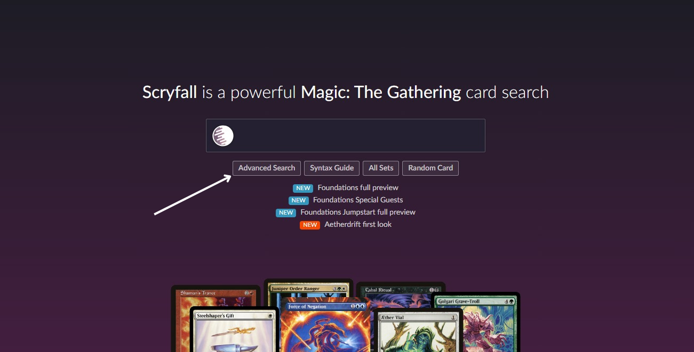
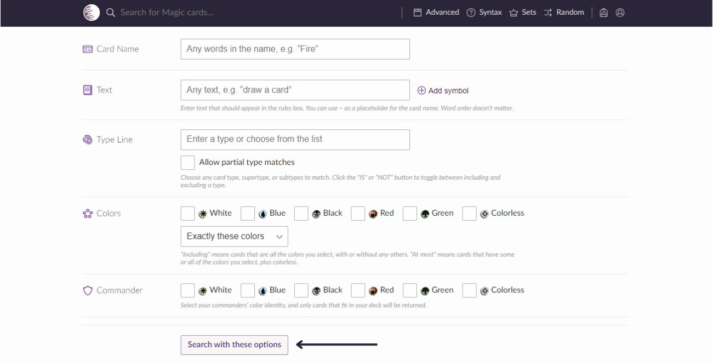
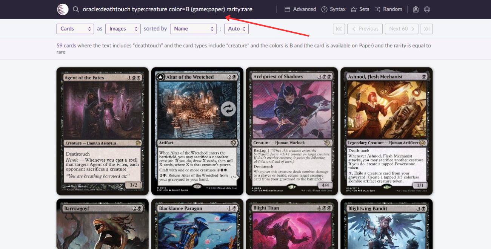

# Scryfall Cards Data Collector

Este projeto utiliza a [API do Scryfall](https://scryfall.com/docs/api) para realizar buscas e coletar dados de cartas do popular jogo de cartas Magic: The Gathering (MTG). Através dele, você pode pesquisar cartas com parâmetros personalizados e organizar os dados em um DataFrame do pandas, facilitando análises de preço, raridade, cores e outros atributos das cartas.

O projeto é configurado para realizar buscas de cartas físicas, pois, diferentemente das cartas virtuais, as cartas físicas possuem um preço, o que é um dado valioso para fins de análise.

Se desejar realizar uma busca que inclua cartas virtuais, basta remover o parâmetro (game:paper) ao criar a instância do objeto:
```bash
def __init__(self, card_type):
        self.params = {'q': f'(game:paper) {card_type}'}
        self.api_search_url = 'https://api.scryfall.com/cards/search'
```

## Funcionalidades

- **Busca de cartas personalizada**: Especifique parâmetros como tipo de carta, cor, raridade, e habilidades de jogo.
- **Criação de DataFrame**: Extrai dados das cartas e organiza em um `DataFrame` do pandas com atributos como nome, tipo, data de lançamento, preço em dólar, custo de mana convertido, cores e raridade.
- **Exploração e análise de dados**: O `DataFrame` permite realizar uma análise mais profunda dos dados das cartas para diferentes propósitos, como avaliação de mercado, coleções e estudos estatísticos.

## Como Usar

### 1. Pré-requisitos
Este projeto requer o Python e as bibliotecas `requests` e `pandas`. Instale as bibliotecas com:
```bash
pip install requests pandas
```
### 2. Instruções de Uso
Primeiro, crie uma instância da classe Scryfall_Cards (você também pode executar pelo terminal sem precisar importar), passando o tipo de carta desejado (por exemplo, type:creature):
```python
from scryfall_cards import Scryfall_Cards

# Exemplo de criação da instância
cards = Scryfall_Cards('type:creature')
```
#### Criar DataFrame
Para criar um DataFrame pandas contendo as informações das cartas, utilize o método create_df_cards().
```python
cards_df = cards.create_df_cards()
print(cards_df.head())
```
## Parâmetros Disponíveis
Existem muitos parâmetros que são aceitos pela classe Scryfall_Cards, dentre os vários, incluem:
* Tipo (type): creature, enchantment, planeswalker, etc.
* Cor (color): r (red), u (blue), w (white), b (black), g (green), colorless, combinações como gw (green and white), etc.
* Custo de Mana Convertido (cmc): 1, <2, >=3, etc.
* Raridade (rarity): mythic, common, uncommon, etc.
* Atributo de Jogo (oracle): flying, infect, trample, etc.

Para obter ajuda detalhada sobre os parâmetros, use o método estático help_params():
```python
Scryfall_Cards.help_params()
```
## Preenchendo os Parâmetros com o Scryfall

Outra forma de preencher os parâmetros para a criação do objeto é utilizar o próprio site do [Scryfall](https://scryfall.com). Basta clicar em **Advanced Search**:



Depois, preencha os filtros de acordo com as características das cartas que você deseja procurar e clique em **Search With These Options**:



Ao clicar, todas as cartas que atendem à filtragem aparecerão. Agora, basta copiar o texto da pesquisa gerada e colá-lo no parâmetro ao criar o objeto:



Exemplo de criação do objeto com a pesquisa feita no Scryfall:

```python
cards = Scryfall_Cards('oracle:deathtouch type:creature color=B (game:paper) rarity:rare')
cards_df = cards.create_df_cards()
```
## Estrutura do DataFrame
O DataFrame gerado possui as seguintes colunas:
* card_name: Nome da carta
* card_type: Tipo da carta
* release: Data de lançamento
* usd_price: Preço em dólares (se disponível)
* cmc: Custo de Mana Convertido
* color_identity: Identidade de cor da carta
* rarity: Raridade da carta

## Exemplo de Saída
```
   card_name         card_type     release usd_price cmc color_identity rarity
0  Sol Ring      Artifact        1993-08-05  1.50    1     ['C']         uncommon
1  Black Lotus  Artifact         1993-08-05  15000.00  0    ['C']         mythic
...
```
## Observações
* Este projeto é focado em busca e análise de cartas para Magic: The Gathering usando a API do Scryfall.
* Tenha em mente os limites de taxa da API, especialmente ao realizar buscas grandes ou repetidas.

## Conclusão
Esse projeto oferece uma ferramenta prática para colecionadores, jogadores e entusiastas de MTG que desejam explorar o mundo das cartas de forma automatizada e analítica. Ao usar a API do Scryfall e o pandas, você pode facilmente obter, filtrar e organizar dados de cartas para diversos fins, como análise de preços, planejamento de decks e mais.
